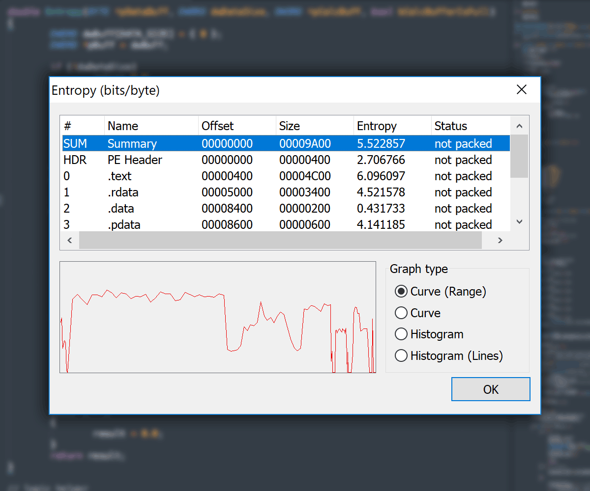
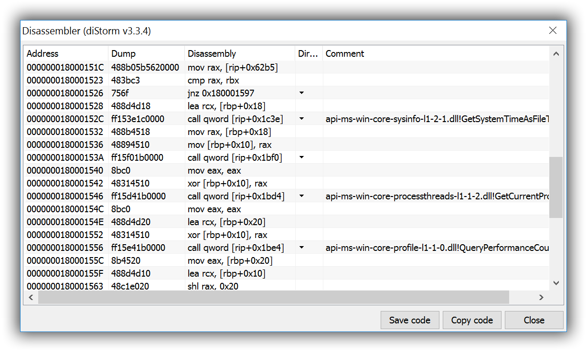

# Встречайте новый релиз старого-доброго PE Tools
Прошло много лет с тех пор, как NEOx выложил последнюю публичную версию PE Tools в 2006 году, и вы уже могли сто раз подумать, что PET мёртв, но он ожил на некоторое время, чтобы предстать перед вами в 2018 году!

## Основные изменения

### Исправления

> В первую очередь новый релиз - это огромное количество багфиксов. Везде, до куда дотянулись наши ручки, были исправлены ошибки, утечки памяти, пофикшена логика работы.
> Не исключено, что при исправлении старых ошибок были добавлены новые, но мы старались, чтобы количество исправленных ошибок не влияло на появление новых ))

### Новые возможности

Было добавлено несколько приятных фич, которые сделают работу с исполняемыми файлами ещё более наглядной:

- абсолютно новый график энтропии, **Entropy View**, (на глаз определяем запакованность, наличие шифрованных данных) в двух режимах: кривая и гистограмма;

- новый движок дизассемблера (раньше был CADt от Ms-Rem, потом Mediana от mika0x65, а теперь это diStorm от Gil Dabah), что позволило реализовать поддержку дизасма как x86 (32 бит), так и x86-64 (64 бит);

- отображение Config directory со всеми новыми полями
- отображение обработчиков исключений (Structured Exception Handler) в Config directory
- удаление директории сертификатов (с самими сертификатами)
- поддержка File System Redirector (Windows-on-Windows, WoW)
- добавлена функция редактирования в hex-редакторе
- корректное отображение списка процессов на современных ОС
- отображение x86-64 процессов
- диалог DLL Characteristics
- сигнатуры для PE Sniffer (Signs.txt) преобразованы в формат PEiD

## Пачка мелких, но полезных фич:

- переход по ярлыкам (.lnk)
- чтение инфы в Debug directory: имя PDB, GUID, типы POGO, VC
- отображение в дизасме направления прыжка (вверх / вниз относительно текущей позиции)
- меню копирования (Copy) и сохранения (Save) в диалоге диазасма и hex-редактора
- опции копирования из hex-редактора: исходник C (C source); экран как есть (Editor display); сырые байты (Hex values)
- добавлены горячие клавиши в меню копирования в hex-редакторе
- заполнение диапазона заданным значением с возможностью применения операций XOR, OR, AND, NOT, диалог Fill Block в hex-редакторе
- в редакторе секций показывается порядковый номер секции (полезно в файлах с большим количеством безымянных секций)
- добавлено действие по умолчанию на двойной клик: открываются соответсвтующие диалоги без необходимости вызова контекстного меню
- корректировка значений полей `OperatingSystemVersion` и `SubsystemVersion` при увеличении количества секций в соответствии с максимально допустимым количеством секций в ОС
- корректный пересчёт и исправление различных размеров заголовков
- определение нескольких int3 опкодов для прекращения быстрого дизасма (fast disasm)
- корректная очистка таблицы релокаций (relocation table) с исправлением соответствующих флагов
- исправлены серьёзные ошибки в File Location Calculator (FLC)
- исправлены ошибки с обрезанием имён функций при добавлении в импорт новой библиотеки
- автоматически скрываемое предупреждение о привилегиях администратора с возможностью отключения

### Get high

Добавлена поддержка высокого разрешения экрана (High DPI), что позволяет не вглядываться в иконки и текст, а наслаждаться комфортными пропорциями интерфейса.

### Чистка

Были убраны лишние на наш взгляд фичи типа старой обновлялки и старой системы плагинов (которые, откровенно говоря, особым функционалом похвастаться не могли, да и выпущено их было всего ничего), сокращено количество внешних библиотек, объединены модули с базовым функционалом.

### Другие изменения

Полный список изменений смотри на сайте PE Tools на Github:

- [HISTORY](https://petoolse.github.io/petools/HISTORY)

Разумеется, было ещё много чего исправлено и добавлено по мелочи, о чём нет смысла писать подробно (да и не всё упомнишь), поэтому проще скачать и убедиться самостоятельно.

### Ссылки

Сайт проекта на Github:

- [petoolse.github.io/petools](https://petoolse.github.io/petools)

Новости проекта:

- [@petoolse](https://twitter.com/petoolse)

## СКАЧАТЬ

- [github.com/petoolse/petools/releases](https://github.com/petoolse/petools/releases)

--
- Jupiter
- PainteR

`2018.03.30`

[back](./)
