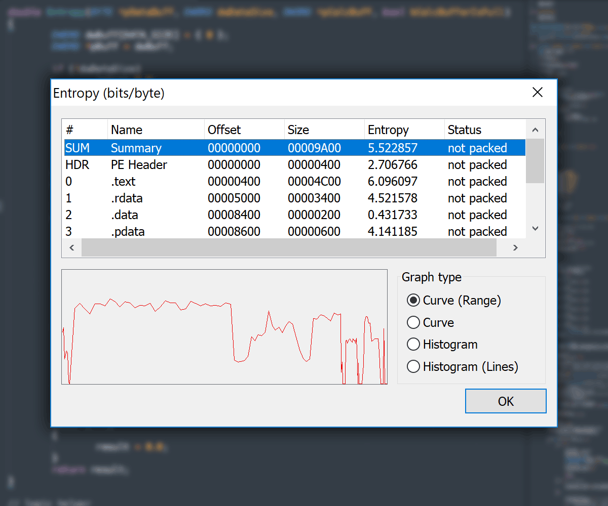
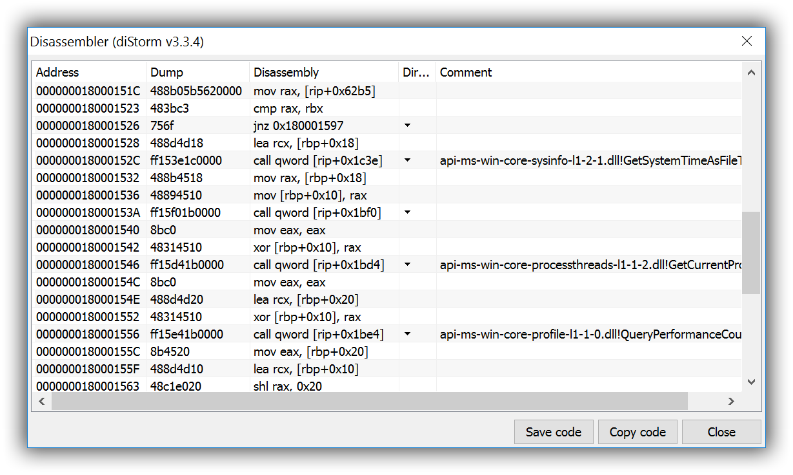

**PE Tools** - [portable executable][pe.wiki] (PE) manipulation toolkit.


## Table of contents

- [Description](#description)
- [Features](#features)
	- [PE Editor](#pe-editor)
	- [File Location Calculator](#file-location-calculator-flc)
	- [PE Files Comparator](#pe-files-comparator)
	- [Process Viewer and Manager](#process-viewer-and-manager)
	- [PE Dumper](#pe-dumper)
	- [PE Rebuilder](#pe-rebuilder)
	- [PE Sniffer](#pe-sniffer)
- [System Requirements](system-requirements)
- [Limitations](#limitations)
- [To do](#to-do)
- [What's new](#whats-new-in-recent-major-releases)
- [Creators](#creators)
- [Contacts](#contacts)


## Description

> **PE Tools** lets you actively *research* PE files and processes.
> `Process Viewer` and PE files `Editor`, `Dumper`, `Rebuilder`, `Comparator`, `Analyzer` are included.
> **PE Tools** is an *oldschool reverse engineering tool* with a long history since `2002`.
> PE Tools was initially inspired by LordPE (yoda).


## Features

### PE Editor

- PE and DOS Headers **Editor**
- PE Sections **Editor**
- PE Directory _Viewer_ and **Editor**
- Export Directory **Editor**
- Import Directory **Editor**
- Resource Directory _Viewer_
- Exception Directory _Viewer_
- Relocation Directory _Viewer_
- Debug Directory _Viewer_
- TLS Directory **Editor**
- Load Config Directory **Editor**
- Bound Directory **Editor**


### File Location Calculator (FLC)

- Virtual Address
- Relative Virtual Address
- Raw File Offset


## PE Files Comparator

- Side-by-side comparison of headers and characteristics of two PE files


## Process Viewer and Manager

- Show basic process information
- Show process modules


## PE Dumper

- Running process dumper
	- Full Dump
	- Partial Dump
	- Region Dump
- ~~Dumper Server (accessible via Dumper Server SDK)~~


## PE Rebuilder

- Dump Fixer
- Relocation Wiper
- Resource Directory Rebuilder
- PE file Validation
- Imports Binder
- ImageBase Changer


## PE Sniffer

- Signature analysis of PE files
- Packer detection


## HEX Editor

- HEX Editor available in:
	- `Section Editor` via section context menu
	- Every `Data Directory` in `Directory Editor`

## Plugins

- ~~PE Tools `Plugin SDK` available~~


## What's new in recent major releases

### PE Tools v1.9

Complete PE Tools v1.9 announces:

- [PE Tools v1.9 announce in English](Announce-EN)
- [PE Tools v1.9 announce in Russian](Announce-RU)


#### Entropy View


- Entropy Viewer available in:
	- Main `PE Editor` dialog
	- `Section Editor` via section context menu
	- `File Compare` dialog for both compared files


#### 64-bit Disassembler


- [diStorm][distorm.gh] `v3.3.4`
- Shows `jmp / call` direction


#### Load Config Directory Editor

- `IMAGE_LOAD_CONFIG_DIRECTORY` support
- Additional Load Config Directory values and size support (non-standard sizes)

#### High-DPI display modes support

- 192 DPI supported
- `DPI` modes supported and tested: `96`, `120`, `144`, `192`
- Graphics redrawn:
	- Main Application Icon
	- Logo
	- Toolbar icons


#### Bug-fixes and minor changes

See [HISTORY][petools.history.gh].


## System Requirements

- Latest tested Operating System: [Windows 11][win.11.wiki]
- Supported Windows versions:
	- [Windows 11][win.11.wiki]
	- [Windows 10][win.10.wiki]
	- [Windows 8.1][win.8.1.wiki]
	- [Windows 8][win.8.wiki]
	- [Windows 7][win.7.wiki]
- Minimal Operating System: [Windows XP][win.xp.wiki]
- Administrative rights for `SeDebugPrivilege`
- macOS supported via [Wine][wine] (tested Wine 3.4, 3.0, 2.16)
- [ReactOS][reactos] natively supported (tested ReactOS 0.4.7)


## Limitations

- No [large files support][lfs.wiki] (over 4 GB)
- No [ARM disassembler][arm.wiki] support (ARM architecture supported by [Windows 10 Mobile][win10.mob.wiki], [Windows RT][win.rt.wiki], [Windows Phone][win.phone.wiki], [Windows IoT Core][win.iot.wiki], [Windows Embedded Compact][win.emb.wiki])


## Source code

```C++
throw std::exception("PE Tools source code is not available!");
```

- If you want to add some features, write ready-to-use snippet (C/C++) and post it in [Issues][petools.issues.gh]


## To do

- [ ] `Win64` version
- [ ] File `Overlay` Analyzer and Extractor
- [ ] `Authenticode` Viewer
- [x] `Rich` Signature Editor
- [ ] `Relocations` Checker
- [ ] Enhance `Debug` Directory Remover: remove debug section if empty
- [ ] [Corkami][corkami.gh] binaries testing and support
- [ ] `.NET Directory` Viewer
- [ ] `External Tools` support (preliminary list):
	- [ ] [x64dbg][x64dbg.gh]
	- [ ] [Scylla Imports Reconstruction][scylla.gh]
	- [ ] [Hiew][hiew]
	- [ ] [r2][radare.gh]
	- [ ] [Resource Hacker][reshacker]
- [ ] `Structures Export` to readable formats like `JSON` / `YAML`
- [ ] `Crypto` tools (`hash`, `decryption` / `decryption`)
- [ ] `ARM` disassembler (far-far-away)


## Distribution

| File             | Description                    | Lang |
|:-----------------|:-------------------------------|:-----|
| `PETools.exe`    | main PE Tools executable       |
| `HEdit.dll`      | Hex-editor                     |
| `RebPE.dll`      | PE Rebuilder                   |
| `Signs.txt`      | PEiD signatures for PE Sniffer |
| `ReadMe_EN.md`   | ReadMe                         | EN
| `WhatsNew_EN.md` | What's New                     | EN
| `WhatsNew_RU.md` | What's New                     | RU
| `petools.sha1`   | Checksums SHA-1                |


## DOWNLOAD

- [github.com/petoolse/petools/releases][petools.releases.gh]


## Licensing

See [LICENSE](LICENSE).


## Creators

### PE Tools

- NEOx [[uinC][pe.tools.uinc]] - versions up to `1.5`, 2002-2006
- [Jupiter][jupiter.gh] - versions from `1.5`, 2007-2018
- [PainteR][painter.gh] - versions from `1.8`, 2017-2018
- [Dmitry Andriyankov][andriyankov.gh] aka [EvilsInterrupt][andriyankov.habr] aka [NtVisigoth][andriyankov.blogspot] - versions from `1.5`, 2012-2014


### Additional modules

- Danilo Bzdok aka [yoda][yoda.archive] (author of [LordPE][lordpe.archive]): original HEdit32 component.


## Contacts

Feel free to contact via Twitter [@petoolse][twitter].


[distorm.gh]: https://github.com/gdabah/distorm

[pe.wiki]: https://en.wikipedia.org/wiki/Portable_Executable

[win.11.wiki]: https://en.wikipedia.org/wiki/Windows_11
[win.10.wiki]: https://en.wikipedia.org/wiki/Windows_10
[win.8.1.wiki]: https://en.wikipedia.org/wiki/Windows_8.1
[win.8.wiki]: https://en.wikipedia.org/wiki/Windows_8
[win.7.wiki]: https://en.wikipedia.org/wiki/Windows_7
[win.xp.wiki]: https://en.wikipedia.org/wiki/Windows_XP

[lfs.wiki]: https://en.wikipedia.org/wiki/Large_file_support
[arm.wiki]: https://en.wikipedia.org/wiki/ARM_architecture#Operating_system_support
[win.10.mob.wiki]: https://en.wikipedia.org/wiki/Windows_10_Mobile
[win.rt.wiki]: https://en.wikipedia.org/wiki/Windows_RT
[win.phone.wiki]: https://en.wikipedia.org/wiki/Windows_Phone
[win.iot.wiki]: https://en.wikipedia.org/wiki/Windows_IoT#Core
[win.emb.wiki]: https://en.wikipedia.org/wiki/Windows_Embedded_Compact

[wine]: https://www.winehq.org
[reactos]: https://www.reactos.org

[corkami.gh]: https://github.com/corkami/pocs/tree/master/PE/bin
[x64dbg.gh]: https://github.com/x64dbg/x64dbg
[scylla.gh]: https://github.com/x64dbg/Scylla
[hiew]: https://hiew.ru
[radare.gh]: https://github.com/radare/radare2
[reshacker]: https://www.angusj.com/resourcehacker

[petools.releases.gh]: https://github.com/petoolse/petools/releases
[petools.issues.gh]: https://github.com/petoolse/petools/issues
[petools.history.gh]: https://petoolse.github.io/petools/HISTORY

[pe.tools.uinc]: https://web.archive.org/web/20171201053946/uinc.ru/files/neox/PE_Tools.shtml

[jupiter.gh]: https://github.com/upiter
[painter.gh]: https://github.com/pr701

[andriyankov.gh]: https://github.com/andriyankov
[andriyankov.habr]: https://habr.com/ru/users/EvilsInterrupt
[andriyankov.blogspot]: https://ntvisigoth.blogspot.com
[andriyankov.bitbucket]: https://bitbucket.org/sys_dev

[lordpe.archive]: https://web.archive.org/web/20070823025434/scifi.pages.at/yoda9k/LordPE/info.htm
[yoda.archive]: https://web.archive.org/web/20041023153231/scifi.pages.at/yoda9k/aboutme.htm

[twitter]: https://x.com/petoolse
